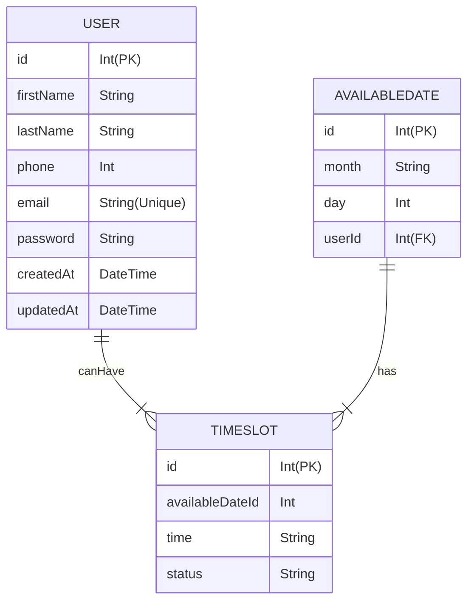

# Enitity Relational Diagram

```mermaid

erDiagram

USER {
    id Int(PK)
    firstName String
    lastName String
    phone Int
    email String(Unique)
    password String
    createdAt DateTime
    updatedAt DateTime
}

AVAILABLEDATE {
    id Int(PK)
    month  String
    day    Int
    userId Int(FK)
}

TIMESLOT {
    id Int(PK)
    availableDateId Int
    time String
    status String
}

USER ||--|{ TIMESLOT : canHave

AVAILABLEDATE ||--|{ TIMESLOT : has

```