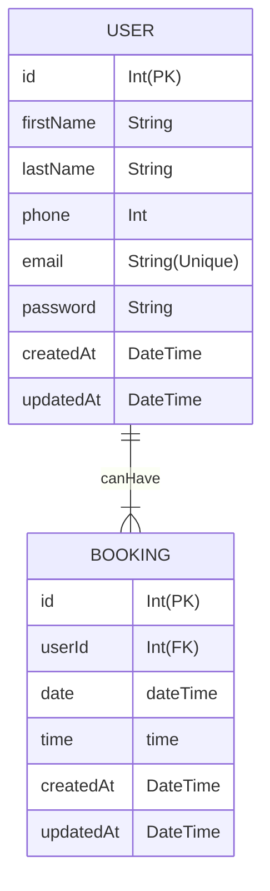

# Enitity Relational Diagram

```mermaid

erDiagram

USER {
    id Int(PK)
    firstName String
    lastName String
    phone Int
    email String(Unique)
    password String
    createdAt DateTime
    updatedAt DateTime
}

BOOKING {
    id Int(PK)
    userId Int(FK)
    date dateTime
    time time
    createdAt DateTime
    updatedAt DateTime
}

USER ||--|{ BOOKING : canHave

```